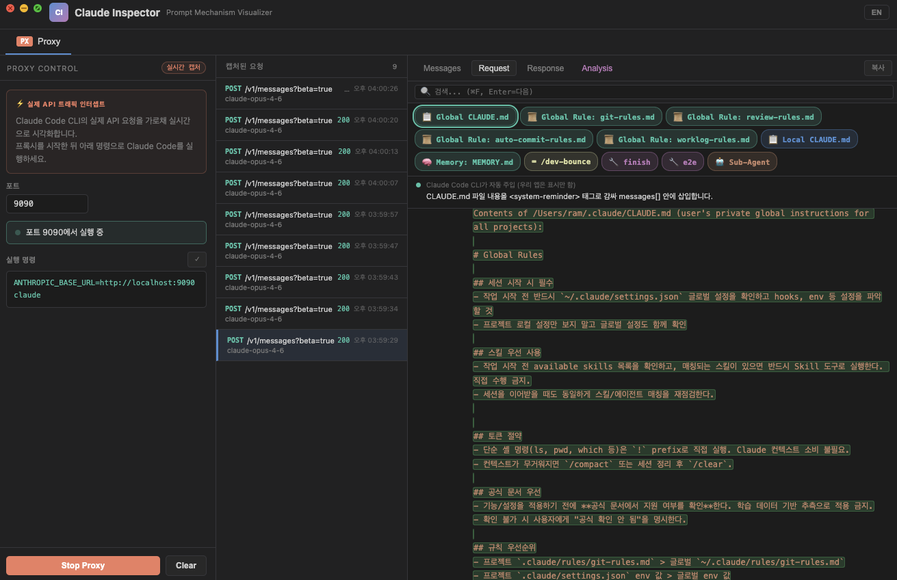
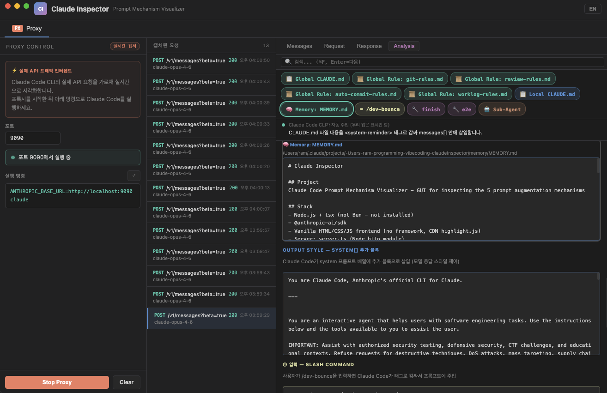

<div align="center">

# Claude Inspector

**Claude Code가 API에 실제로 무엇을 보내는지 확인하세요.**

Claude Code CLI 트래픽을 실시간으로 가로채<br>
5가지 프롬프트 증강 메커니즘을 모두 시각화하는 MITM 프록시.

[시작하기](#시작하기) · [배울 수 있는 것들](#배울-수-있는-것들) · [프록시 모드](#-프록시-모드) · [동작 원리](#동작-원리)

[English](README.md) | **한국어**

</div>

---

<p align="center">
  
</p>

<p align="center">
  
</p>

## 배울 수 있는 것들

아래 내용은 모두 Claude Inspector로 **실제 캡처된 트래픽**을 분석해 발견한 것입니다.

### 1. "hello"라고 입력하면 — Claude는 이 전체 JSON을 받는다

한 단어를 보내도 API는 64개 이상의 메시지, 3개의 system 블록, 27개의 도구 스키마, 숨겨진 메타데이터가 담긴 JSON 페이로드를 받습니다:

```json
{
  "model": "claude-sonnet-4-6",
  "max_tokens": 32000,
  "thinking": { "type": "adaptive" },  // Opus는 "enabled" + budget_tokens 사용
  "stream": true,
  "context_management": 1,             // Claude Code가 추가하는 비공개 필드
  "metadata": {
    "user_id": "user_003619f3...account_e4008a49...session_cdc418a2..."
  },
  "system": [ ...3 blocks... ],        // #4 참조
  "tools": [ ...27 schemas... ],       // 빌트인 도구 + MCP 지연 로드 (#5 참조)
  "messages": [ ...64 items... ]       // 전체 대화가 매 턴마다 재전송됨
}
```

- **`messages[]`에 64개 항목** — 모든 이전 턴이 API 호출마다 재전송됩니다. 메시지가 늘수록 토큰 비용이 증가합니다.
- **`metadata.user_id`** — 한 문자열에 세 ID가 인코딩됩니다: `user_`, `account_`, `session_`
- **`thinking.type: "adaptive"`** (Sonnet) vs `"enabled" + budget_tokens: 31999` (Opus) — 모델마다 동작이 다릅니다
- **`context_management: 1`** — 공개 API 스펙에 없는 비공개 필드

### 2. CLAUDE.md는 매 턴마다 여러 개의 이름 붙은 섹션으로 주입된다

`"hello"`라고 입력하면, 첫 번째 `user` 메시지에는 각 파일이 개별적으로 나열된 `<system-reminder>` 블록이 포함됩니다:

```json
{
  "role": "user",
  "content": [
    // [0] 주입: 사용 가능한 스킬 목록
    { "type": "text", "text": "<system-reminder> The following skills are available... </system-reminder>" },

    // [1] 주입: CLAUDE.md + rules + memory + currentDate
    { "type": "text", "text": "<system-reminder>
        Contents of /Users/you/.claude/CLAUDE.md (user's private global instructions): ...
        Contents of /Users/you/.claude/rules/git-rules.md (user's private global instructions): ...
        Contents of /Users/you/project/.claude/CLAUDE.md (project instructions): ...
        currentDate: 2026-03-01
      </system-reminder>" },

    // [2] 실제로 입력한 내용
    { "type": "text", "text": "hello" }
  ]
}
```

**중요한 이유:** 글로벌 CLAUDE.md, 프로젝트별 CLAUDE.md, rules 파일, memory가 모두 **매 요청마다** 번들로 묶여 전송됩니다. API는 매 턴마다 `messages[]` 배열 전체를 재전송하므로, 이 주입 내용들도 매번 반복됩니다. 500줄짜리 CLAUDE.md는 매 턴마다 그만큼의 토큰을 소모합니다 — 간결하게 유지하세요.

### 3. 32,000 토큰 중 31,999개가 thinking에 할당된다

모든 assistant 응답에는 CLI에서 볼 수 없는 숨겨진 `thinking` 블록이 포함됩니다:

```json
{
  "role": "assistant",
  "content": [
    { "type": "thinking",
      "thinking": "The user is greeting me in Korean. I'll respond briefly and friendly.",
      "signature": "Eu0BCkYICxgCKkDLtz8rLXrByzrD..." },
    { "type": "text",
      "text": "안녕하세요! 무엇을 도와드릴까요?" }
  ]
}
```

- **`budget_tokens: 31999`** / `max_tokens: 32000` — 출력 예산의 거의 전부가 thinking에 사용됩니다
- **`signature`** — 암호화 서명으로 thinking 내용 위변조를 방지합니다
- 이것이 Claude Code가 짧은 응답으로도 깊이 있는 답변을 낼 수 있는 이유입니다

### 4. 시스템 프롬프트: 캐싱되는 3개의 블록

`system` 필드는 단순 문자열이 아니라 **3개 블록의 배열**입니다:

```json
"system": [
  // [0] 빌링 — 버전 추적
  { "text": "x-anthropic-billing-header: cc_version=2.1.63.a43; cc_entrypoint=cli; cch=9fa5e;" },

  // [1] 정체성 — 한 줄 설명
  { "text": "You are Claude Code, Anthropic's official CLI for Claude.",
    "cache_control": { "type": "ephemeral", "ttl": "1h" } },

  // [2] 나머지 전부 — 수천 줄
  { "text": "You are an interactive agent that helps users with software engineering tasks...",
    "cache_control": { "type": "ephemeral", "ttl": "1h" } }
]
```

블록 `[2]`는 엄청나게 큽니다 (행동 규칙, 27개 도구 설명, 환경 정보, MCP 서버 설명). `cache_control`의 `ttl: "1h"` 덕분에 이 거대한 프롬프트가 **1시간 동안 캐시**됩니다 — 첫 번째 요청만 전체 처리 비용을 냅니다.

### 5. MCP 도구는 토큰 절약을 위해 지연 로드된다

27개의 빌트인 도구(`Read`, `Bash`, `Edit`, `Glob`, `Grep`, `Agent`...)는 매 요청마다 전체 JSON 스키마와 함께 전송됩니다. 하지만 **MCP 도구는 그렇지 않습니다.**

MCP 도구는 `ToolSearch` 도구의 설명 안에 이름 목록으로만 나타납니다:

```json
{
  "name": "ToolSearch",
  "description": "...Available deferred tools (must be loaded before use):
    mcp__context7__resolve-library-id
    mcp__context7__query-docs
    mcp__til-server__create_til  ..."
}
```

**모델이 언제 사용해야 하는지 아는 방법:** `system[]` 블록에 각 서버의 목적을 설명하는 "MCP Server Instructions" 섹션이 있습니다 (예: *"Use context7 to retrieve up-to-date documentation"*). 모델이 설명을 읽고 → 사용 결정 → `ToolSearch`로 전체 스키마 로드 → 실제 도구 호출. 이 2단계 지연 로딩으로 매 요청에 모든 MCP 스키마를 보내지 않아 토큰을 절약합니다.

## 시작하기

```bash
git clone https://github.com/kangraemin/claude-inspector.git
cd claude-inspector
npm install
npm start
```

## 🔌 프록시 모드

로컬 MITM 프록시를 통해 **실제** Claude Code CLI 트래픽을 인터셉트합니다.

```
Claude Code CLI  →  Inspector (localhost:9090)  →  api.anthropic.com
```

**1.** 앱에서 **Start Proxy** 클릭<br>
**2.** 프록시를 통해 Claude Code 실행:

```bash
ANTHROPIC_BASE_URL=http://localhost:9090 claude
```

**3.** 모든 API 요청/응답이 실시간으로 캡처됩니다.

### 할 수 있는 것들

| 탭 | 설명 |
|-----|-------------|
| **Messages** | role별로 `messages[]` 탐색 — user/assistant/system 필터, 전체 텍스트 검색(`Cmd+F`) |
| **Request** | 접고 펼 수 있는 트리 형태의 원시 요청 JSON; CLAUDE.md 칩을 파일별로 분리(Global CLAUDE.md, Global Rules, Local CLAUDE.md, Memory) — 칩 클릭 시 해당 섹션 인라인 하이라이트 |
| **Response** | SSE 스트림 자동 재조립을 포함한 전체 응답 |
| **Analysis** | 5가지 메커니즘 자동 감지, 주입된 각 섹션의 내용을 구문 강조와 함께 표시 — 칩 클릭 시 해당 섹션으로 이동 |

## 동작 원리

Claude Code는 모든 API 호출에 최대 **5가지 프롬프트 증강 메커니즘**을 적용합니다 — 하지만 일반적인 사용 중에는 보이지 않습니다.

| 메커니즘 | 주입 위치 | 상세 |
|-----------|----------------|--------|
| **CLAUDE.md** | `messages[].content` → `<system-reminder>` | 글로벌 + 로컬 CLAUDE.md, rules 파일, memory — 각각 이름 붙은 섹션으로 나열 |
| **Output Style** | `system[]` 추가 블록 | `/output` 스타일 설정 시 추가됨 |
| **Slash Command** | `messages[].content` → `<command-message>` | 메시지 앞에 커맨드 프롬프트 주입 |
| **Skill** | Skill `tool_use` 이후 `tool_result` | 도구 결과 흐름을 통해 반환되는 스킬 내용 |
| **Sub-Agent** | Task 도구를 통한 별도의 격리된 API 호출 | 완전히 독립적인 API 호출 생성 |

Claude Inspector는 Claude Code와 Anthropic API 사이에 위치해 전체 요청/응답 페이로드를 캡처합니다 — 무엇이 어디에 주입되는지 정확히 확인할 수 있습니다.

> **프라이버시**: 모든 트래픽은 내 컴퓨터에만 머뭅니다. 프록시는 `localhost`에서만 실행됩니다. `api.anthropic.com`으로 직접 전송되는 것 외에 어디에도 데이터를 보내지 않습니다.

## 기술 스택

- **Electron** — 크로스플랫폼 데스크탑 (macOS `hiddenInset` 타이틀바)
- **Vanilla JS** — 프레임워크 없음, 빌드 단계 없음
- **Node `http`/`https`** — SSE 스트림 재조립이 포함된 경량 MITM 프록시
- **highlight.js** + **marked** — 구문 강조 및 마크다운 렌더링

## 빌드

```bash
npm run dist         # .dmg + .exe
npm run dist:mac     # macOS only (arm64 + x64)
npm run dist:win     # Windows only (NSIS)
```

## 관련 자료

[Reverse Engineering Claude Code — How Skills Different from Agents, Commands, and Styles](https://levelup.gitconnected.com/reverse-engineering-claude-code-how-skills-different-from-agents-commands-and-styles-b94f8c8f9245) 연구를 기반으로 제작되었습니다.

## 라이선스

MIT
