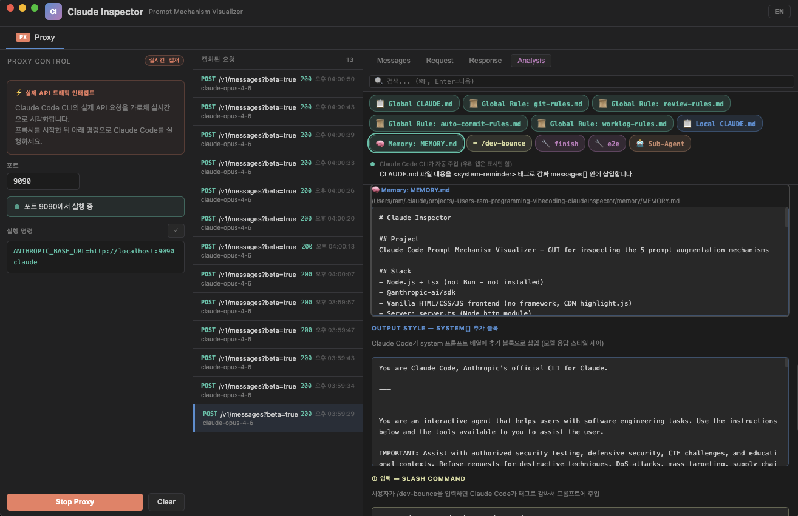

<div align="center">

# Claude Inspector

**Claude Code가 API에 실제로 무엇을 보내는지 확인하세요.**

Claude Code CLI 트래픽을 실시간으로 가로채<br>
5가지 프롬프트 증강 메커니즘을 모두 시각화하는 MITM 프록시.

[설치](#설치) · [배울 수 있는 것들](#배울-수-있는-것들) · [프록시 모드](#-프록시-모드) · [동작 원리](#동작-원리)

[English](README.md) | **한국어**

</div>

---

<p align="center">
  
</p>

<p align="center">
  
</p>

## 배울 수 있는 것들

아래 내용은 모두 Claude Inspector로 **실제 캡처된 트래픽**을 분석해 발견한 것입니다.

### 1. CLAUDE.md는 매 턴마다 여러 개의 이름 붙은 섹션으로 주입된다

모든 user 메시지는 실제로 3개의 content 블록으로 구성됩니다. 직접 입력한 텍스트는 `content[2]`뿐이고, 나머지 두 개는 Claude Code가 자동으로 앞에 붙입니다:

```json
{
  "role": "user",
  "content": [
    // [0] Claude Code가 주입하는 스킬 목록
    { "type": "text", "text": "<system-reminder>\nThe following skills are available...\n</system-reminder>" },

    // [1] 모든 CLAUDE.md + rules + memory + 날짜 — 이 캡처에서 8,528자
    { "type": "text", "text": "<system-reminder>\n
        Contents of /Users/you/.claude/CLAUDE.md (user's private global instructions):\n...
        Contents of /Users/you/.claude/rules/git-rules.md (user's private global instructions):\n...
        Contents of /Users/you/project/.claude/CLAUDE.md (project instructions):\n...
        Contents of /Users/you/project/.claude/memory/MEMORY.md (auto-memory):\n...
        currentDate: 2026-03-01
      \n</system-reminder>" },

    // [2] 실제로 입력한 내용
    { "type": "text", "text": "hello" }
  ]
}
```

**주입 순서는 항상 고정:** 글로벌 CLAUDE.md → 글로벌 rules 파일 → 로컬 CLAUDE.md → 자동 메모리 → `currentDate`.

**왜 비용이 배가 되는가:** Claude Code는 매 API 호출마다 `messages[]` 배열 **전체**를 재전송합니다. 대화가 30턴이라면, 8,500자 분량의 CLAUDE.md가 페이로드 안에 30번 등장합니다 — `messages[0]`에 한 번씩 포함되어서요. 500줄짜리 CLAUDE.md는 모든 요청마다, 영원히, 토큰을 소모합니다. 간결하게 유지하세요.

### 2. MCP 도구는 토큰 절약을 위해 지연 로드된다

27개의 빌트인 도구(`Read`, `Bash`, `Edit`, `Glob`, `Grep`, `Agent`...)는 매 요청마다 **전체 JSON 스키마**와 함께 전송됩니다. 하지만 **MCP 도구는 그렇지 않습니다** — 처음에는 이름 목록만 존재합니다:

```json
{
  "name": "ToolSearch",
  "description": "...Available deferred tools (must be loaded before use):\nmcp__til-server__create_til\nmcp__til-server__update_til\n..."
}
```

**2단계 지연 로드 흐름:**

1. `system[]` 블록의 "MCP Server Instructions" 섹션에서 각 서버의 목적을 설명합니다 (*"Use context7 to retrieve up-to-date documentation"*)
2. 모델이 설명을 읽고 MCP 도구가 필요하다고 판단합니다
3. 모델이 `ToolSearch`를 쿼리로 호출 → 전체 스키마가 반환되어 `tools[]`에 추가됩니다
4. 모델이 실제 MCP 도구를 호출합니다

**이 캡처에서의 전/후:** `ToolSearch`에 8개의 MCP 도구가 지연 도구로 등록되어 있습니다. 하지만 `mcp__context7__resolve-library-id`와 `mcp__context7__query-docs`는 세션 앞부분에서 이미 로드되어 `tools[]`에 포함됩니다 → 총 29개(빌트인 27개 + 로드된 MCP 2개). `til-server` 6개는 아직 필요하지 않아 지연 상태입니다.

사용하지 않는 MCP 스키마는 토큰을 전혀 소비하지 않는 것이 핵심입니다.

### 3. Skill ≠ Command — 세 가지 주입 경로

Claude Code에서 `/something`을 입력했을 때, 그 "something"이 무엇이냐에 따라 완전히 다른 메커니즘이 작동합니다. API 페이로드에서의 모습도 전혀 다릅니다:

**로컬 커맨드** — CLI 클라이언트에서만 처리되며, 모델에 도달하지 않습니다:

```json
// /mcp 입력 시
{
  "role": "user",
  "content": [
    { "type": "text", "text": "<command-name>/mcp</command-name>\n<command-message>mcp</command-message>" },
    { "type": "text", "text": "<local-command-stdout>MCP dialog dismissed</local-command-stdout>" }
  ]
}
```

CLI가 로컬 UI 다이얼로그를 열고, 결과를 캡처한 뒤 `<local-command-stdout>`으로 메시지에 주입합니다. 모델은 결과만 봅니다.

**사용자가 호출한 스킬** — 스킬 프롬프트 전체가 user 메시지에 직접 주입됩니다:

```json
// /dev-bounce fix the scroll bug 입력 시
{
  "role": "user",
  "content": [
    { "type": "text", "text": "<command-message>dev-bounce</command-message>\n<command-name>/dev-bounce</command-name>\n<command-args>fix the scroll bug</command-args>" },
    { "type": "text", "text": "Base directory for this skill: /Users/you/.claude/skills/dev-bounce\n\n# dev-bounce\n\n스킬 프롬프트 전체 텍스트..." }
  ]
}
```

CLI가 스킬을 찾아 프롬프트 파일을 읽고, XML 태그와 함께 user 메시지에 전체 텍스트를 넣습니다.

**어시스턴트가 호출한 스킬** — 모델이 `tool_use`로 스킬을 호출하고, `tool_result`로 프롬프트를 받습니다:

```json
// 어시스턴트가 Skill 도구 호출
{ "type": "tool_use", "name": "Skill", "input": { "skill": "finish" } }

// 시스템이 스킬 프롬프트 반환
{ "type": "tool_result", "content": "Launching skill: finish" },
{ "type": "text", "text": "# /finish\n\n스킬 프롬프트 전체 텍스트..." }
```

| | 로컬 커맨드 | 사용자 호출 스킬 | 어시스턴트 호출 스킬 |
|---|---|---|---|
| 예시 | `/mcp`, `/clear`, `/help` | `/dev-bounce`, `/commit` | `Skill("finish")`, `Skill("e2e")` |
| 누가 트리거 | 사용자가 `/` 입력 | 사용자가 `/` 입력 | 모델이 결정 |
| 주입 지점 | user msg 내 `<local-command-stdout>` | user msg 내 `<command-name>` 태그 + 프롬프트 | `tool_use` → `tool_result` |
| 모델에 도달? | 결과만 | 전체 프롬프트 | 전체 프롬프트 |

### 4. 컨텍스트 압축 — 대화가 요약되는 방식

세션이 컨텍스트 윈도우 한계에 가까워지면, Claude Code는 단순히 잘라내지 않습니다 — **전체 대화를 구조화된 요약으로 압축**하여 `messages[0]`에 텍스트 블록으로 삽입합니다:

```json
{
  "type": "text",
  "text": "This session is being continued from a previous conversation that ran out of context.
    The summary below covers the earlier portion of the conversation.\n\n
    Summary:\n
    1. Primary Request and Intent:\n   - 뱃지 스크롤 점프 버그 수정...\n
    2. Key Technical Concepts:\n   - Electron 데스크탑 앱, vanilla HTML/CSS/JS...\n
    3. Files and Code Sections:\n   - public/index.html — line ~2639-2738...\n
    4. Errors and fixes:\n   - 뱃지 스크롤 시도 1 (commit b21672f): ...\n
    5. Problem Solving:\n   - JSON 패딩 누적: 해결 방법...\n
    6. All user messages:\n   - \"아 진짜 개열받는다\"...\n
    7. Pending Tasks:\n   - 뱃지 스크롤 점프 수정 (시도 3)...\n
    8. Current Work:\n   - 세 번째 시도 작업 중...\n
    9. Optional Next Step:\n   - dev-bounce 워크플로우 계속..."
}
```

**보존되는 것:** 요약은 9개의 구조화된 섹션을 포함합니다 — 원래 요청, 기술적 맥락, 정확한 파일 경로와 줄 번호, 에러 히스토리, 사용자 메시지 원문, 진행 중인 작업. 놀라울 정도로 철저합니다.

**사라지는 것:** 개별 도구 호출 결과, 중간 thinking 블록, 세밀한 대화의 주고받음. 모델은 모든 것을 기억하는 것처럼 요약에서 이어가지만, 원본 컨텍스트가 아니라 압축된 재구성에서 작업하는 것입니다.

**비용 트레이드오프:** 153개 메시지 대화(`messages[0]`만 ~40KB)가 ~10KB로 압축됩니다. 하지만 이 요약은 이후 모든 요청마다 전송되어, 섹션 1에서 설명한 비용 복리 효과를 더합니다.

### 5. Plan과 호출된 Skill은 매 요청에 남는다

스킬을 사용하거나 plan 모드에 진입하면, 그 프롬프트는 사용 후 사라지지 않습니다 — 세션이 끝날 때까지 **이후 모든 요청에 재주입**됩니다:

```json
// messages[0].content — 매 턴마다 주입
[
  // 이전에 호출된 스킬 — 이 캡처에서 12,951자
  { "type": "text", "text": "<system-reminder>\nThe following skills were invoked in this session.
      Continue to follow these guidelines:\n\n
      ### Skill: dev-bounce\n  [전체 8KB 스킬 프롬프트...]\n\n
      ### Skill: finish\n    [전체 4KB 스킬 프롬프트...]\n
    </system-reminder>" },

  // 활성 plan 파일 — 4,708자
  { "type": "text", "text": "<system-reminder>\nA plan file exists from plan mode at: /.../plan.md\n\n
      Plan contents:\n# 뱃지 스크롤 수정\n## Context\n...[전체 plan]...\n
    </system-reminder>" }
]
```

**스킬의 숨겨진 비용:** 이 캡처 세션에서 두 개의 호출된 스킬(`dev-bounce` + `finish`)이 매 요청마다 **12,951자**를 추가했습니다. 활성 plan은 **4,708자**를 더 추가했습니다. 합계: **~18KB의 영구 컨텍스트**가 매 API 호출마다 조용히 따라다닙니다 — 섹션 1의 CLAUDE.md 10KB 위에 추가로요.

**왜 중요한가:**
- **스킬은 누적됩니다.** 세션에서 호출한 각 `/skill`은 영원히 남습니다. 3KB 프롬프트를 가진 스킬 5개 = 매 요청마다 15KB 추가.
- **Plan도 남습니다.** plan 모드에서 생성한 plan은 세션이 끝날 때까지 유지됩니다. plan을 완료하지 않으면 계속 토큰을 소모합니다.
- **총합은 놀랍습니다.** 이 Opus 캡처에서: 10KB (CLAUDE.md) + 13KB (스킬) + 5KB (plan) + 10KB (압축된 컨텍스트) = 한 글자 입력하기도 전에 **~38KB의 숨겨진 오버헤드**.

## 설치

### Homebrew (권장)

```bash
brew install --cask kangraemin/tap/claude-inspector
```

**Spotlight**(`Cmd+Space` → "Claude Inspector")로 실행하거나:

```bash
open -a "Claude Inspector"
```

### 직접 다운로드

[⬇ v1.1.1 다운로드 (.dmg)](https://github.com/kangraemin/claude-inspector/releases/latest)

| Mac (Apple Silicon) | Mac (Intel) |
|---|---|
| `Claude-Inspector-1.1.1-arm64.dmg` | `Claude-Inspector-1.1.1-x64.dmg` |

`.dmg`를 열고 앱을 Applications에 드래그한 뒤 실행하세요.

### 삭제

```bash
brew uninstall --cask claude-inspector
```

## 기여자용 시작 방법

```bash
git clone https://github.com/kangraemin/claude-inspector.git
cd claude-inspector
npm install
npm start
```

## 🔌 프록시 모드

로컬 MITM 프록시를 통해 **실제** Claude Code CLI 트래픽을 인터셉트합니다.

```
Claude Code CLI  →  Inspector (localhost:9090)  →  api.anthropic.com
```

**1.** 앱에서 **Start Proxy** 클릭<br>
**2.** 프록시를 통해 Claude Code 실행:

```bash
ANTHROPIC_BASE_URL=http://localhost:9090 claude
```

**3.** 모든 API 요청/응답이 실시간으로 캡처됩니다.

### 할 수 있는 것들

| 탭 | 설명 |
|-----|-------------|
| **Messages** | role별로 `messages[]` 탐색 — user/assistant/system 필터, 전체 텍스트 검색(`Cmd+F`) |
| **Request** | 접고 펼 수 있는 트리 형태의 원시 요청 JSON; CLAUDE.md 칩을 파일별로 분리(Global CLAUDE.md, Global Rules, Local CLAUDE.md, Memory) — 칩 클릭 시 해당 섹션 인라인 하이라이트 |
| **Response** | SSE 스트림 자동 재조립을 포함한 전체 응답 |
| **Analysis** | 5가지 메커니즘 자동 감지, 주입된 각 섹션의 내용을 구문 강조와 함께 표시 — 칩 클릭 시 해당 섹션으로 이동 |

## 동작 원리

Claude Code는 모든 API 호출에 최대 **5가지 프롬프트 증강 메커니즘**을 적용합니다 — 하지만 일반적인 사용 중에는 보이지 않습니다.

| 메커니즘 | 주입 위치 | 상세 |
|-----------|----------------|--------|
| **CLAUDE.md** | `messages[].content` → `<system-reminder>` | 글로벌 + 로컬 CLAUDE.md, rules 파일, memory — 각각 이름 붙은 섹션으로 나열 |
| **Output Style** | `system[]` 추가 블록 | `/output` 스타일 설정 시 추가됨 |
| **Slash Command** | `messages[].content` → `<command-message>` | 메시지 앞에 커맨드 프롬프트 주입 |
| **Skill** | Skill `tool_use` 이후 `tool_result` | 도구 결과 흐름을 통해 반환되는 스킬 내용 |
| **Sub-Agent** | Task 도구를 통한 별도의 격리된 API 호출 | 완전히 독립적인 API 호출 생성 |

Claude Inspector는 Claude Code와 Anthropic API 사이에 위치해 전체 요청/응답 페이로드를 캡처합니다 — 무엇이 어디에 주입되는지 정확히 확인할 수 있습니다.

> **프라이버시**: 모든 트래픽은 내 컴퓨터에만 머뭅니다. 프록시는 `localhost`에서만 실행됩니다. `api.anthropic.com`으로 직접 전송되는 것 외에 어디에도 데이터를 보내지 않습니다.

## 기술 스택

- **Electron** — 크로스플랫폼 데스크탑 (macOS `hiddenInset` 타이틀바)
- **Vanilla JS** — 프레임워크 없음, 빌드 단계 없음
- **Node `http`/`https`** — SSE 스트림 재조립이 포함된 경량 MITM 프록시
- **highlight.js** + **marked** — 구문 강조 및 마크다운 렌더링

## 빌드

```bash
npm run dist         # .dmg + .exe
npm run dist:mac     # macOS only (arm64 + x64)
npm run dist:win     # Windows only (NSIS)
```

## 관련 자료

[Reverse Engineering Claude Code — How Skills Different from Agents, Commands, and Styles](https://levelup.gitconnected.com/reverse-engineering-claude-code-how-skills-different-from-agents-commands-and-styles-b94f8c8f9245) 연구를 기반으로 제작되었습니다.

## 라이선스

MIT
