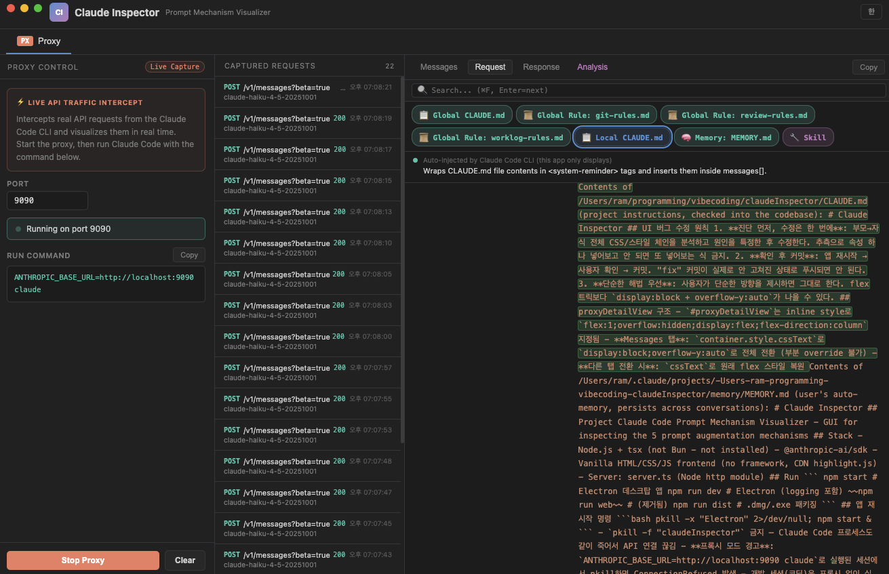
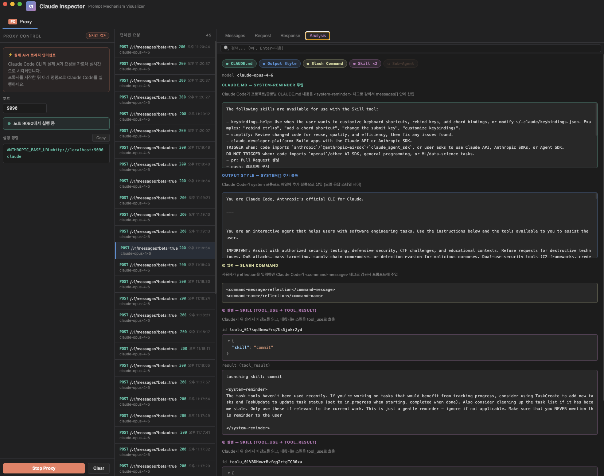

<div align="center">

# Claude Inspector

**See what Claude Code actually sends to the API.**

MITM proxy that intercepts Claude Code CLI traffic in real-time<br>
and visualizes all 5 prompt augmentation mechanisms.

[Getting Started](#getting-started) · [What You'll Learn](#what-youll-learn) · [Proxy Mode](#-proxy-mode) · [How It Works](#how-it-works)

</div>

---

<p align="center">
  
</p>

<p align="center">
  
</p>

## What You'll Learn

Everything below was discovered by inspecting **real captured traffic** with Claude Inspector.

### 1. Your CLAUDE.md is re-sent every single turn

When you type `"hello"`, here's what actually gets sent as your first `user` message:

```json
{
  "role": "user",
  "content": [
    // [0] Injected: available skills
    { "type": "text", "text": "<system-reminder> The following skills are available... </system-reminder>" },

    // [1] Injected: CLAUDE.md + rules + memory + currentDate
    { "type": "text", "text": "<system-reminder> Contents of CLAUDE.md... Contents of git-rules.md... Contents of review-rules.md... currentDate: 2026-03-01 </system-reminder>" },

    // [2] What you actually typed
    { "type": "text", "text": "hello" }
  ]
}
```

**Why this matters:** Your CLAUDE.md, rules files, and memory are bundled into the first `user` message via `<system-reminder>` tags. Since the API re-sends the **entire `messages[]` array** every turn, these injections are included in every single request. A 500-line CLAUDE.md burns those tokens on every turn — keep it concise.

### 2. 31,999 of 32,000 tokens go to thinking

Every assistant response includes a hidden `thinking` block you never see in the CLI:

```json
{
  "role": "assistant",
  "content": [
    { "type": "thinking",
      "thinking": "The user is greeting me in Korean. I'll respond briefly and friendly.",
      "signature": "Eu0BCkYICxgCKkDLtz8rLXrByzrD..." },
    { "type": "text",
      "text": "안녕하세요! 무엇을 도와드릴까요?" }
  ]
}
```

- **`budget_tokens: 31999`** out of `max_tokens: 32000` — virtually the entire output budget is for thinking, not the visible response
- **`signature`** — cryptographic signature prevents tampering with thinking content
- This is why Claude Code can produce thoughtful answers even when the visible output is short

### 3. The system prompt: 3 cached blocks

The `system` field isn't a single string — it's an **array of 3 blocks**:

```json
"system": [
  // [0] Billing — version tracking
  { "text": "x-anthropic-billing-header: cc_version=2.1.63.a43; cc_entrypoint=cli; cch=9fa5e;" },

  // [1] Identity — one-liner
  { "text": "You are Claude Code, Anthropic's official CLI for Claude.",
    "cache_control": { "type": "ephemeral", "ttl": "1h" } },

  // [2] Everything else — thousands of lines
  { "text": "You are an interactive agent that helps users with software engineering tasks...",
    "cache_control": { "type": "ephemeral", "ttl": "1h" } }
]
```

Block `[2]` is massive (behavior rules, all 27 tool instructions, environment info, MCP server descriptions, git status). The `cache_control` with `ttl: "1h"` means this giant prompt is **cached for 1 hour** — only the first request pays the full processing cost.

### 4. MCP tools are lazy-loaded to save tokens

27 built-in tools (`Read`, `Bash`, `Edit`, `Glob`, `Grep`, `Agent`...) are sent with full JSON schemas in every request. But **MCP tools are not.**

MCP tools only appear as a name list inside the `ToolSearch` tool description:

```json
{
  "name": "ToolSearch",
  "description": "...Available deferred tools (must be loaded before use):
    mcp__context7__resolve-library-id
    mcp__context7__query-docs
    mcp__til-server__create_til  ..."
}
```

**How the model knows when to use them:** The `system[]` block contains an "MCP Server Instructions" section describing each server's purpose (e.g., *"Use context7 to retrieve up-to-date documentation"*). The model reads the description → decides to use it → calls `ToolSearch` to load the full schema → then calls the actual tool. This two-step lazy-loading saves tokens by not sending all MCP schemas every request.

### 5. The full request at a glance

Every Claude Code API call sends this structure:

```json
{
  "model": "claude-opus-4-6",
  "system": [ ... ],              // 3 blocks (see #3)
  "messages": [ ... ],            // Full conversation + injected CLAUDE.md/rules (see #1)
  "tools": [ ... ],               // 27 built-in tool schemas (see #4)
  "metadata": { "user_id": "..." },
  "max_tokens": 32000,
  "thinking": { "type": "enabled", "budget_tokens": 31999 },
  "stream": true
}
```

- **`messages[]`** carries the **entire conversation history** — every previous user/assistant turn is re-sent
- **`metadata.user_id`** encodes your account and session ID
- **`stream: true`** — responses are streamed via SSE, which is why you see text appear incrementally

## Getting Started

```bash
git clone https://github.com/kangraemin/claude-inspector.git
cd claude-inspector
npm install
npm start
```

## Proxy Mode

Intercept **real** Claude Code CLI traffic via a local MITM proxy.

```
Claude Code CLI  →  Inspector (localhost:9090)  →  api.anthropic.com
```

**1.** Click **Start Proxy** in the app<br>
**2.** Run Claude Code through the proxy:

```bash
ANTHROPIC_BASE_URL=http://localhost:9090 claude
```

**3.** Every API request/response is captured in real-time.

### What you can do

| Tab | Description |
|-----|-------------|
| **Messages** | Browse `messages[]` by role — filter by user/assistant/system, full-text search (`Cmd+F`) |
| **Request** | Raw request JSON with collapsible tree, mechanism filter chips (CLAUDE.md, Slash Cmd, Skill...) |
| **Response** | Full response including SSE stream auto-reassembly |
| **Analysis** | Auto-detects which of the 5 mechanisms are present and explains each one |

## How It Works

Claude Code enhances every API call with up to **5 prompt augmentation mechanisms** — but these are invisible during normal usage.

| Mechanism | Injection Point |
|-----------|----------------|
| **CLAUDE.md** | `messages[].content` → `<system-reminder>` |
| **Output Style** | `system[]` additional block |
| **Slash Command** | `messages[].content` → `<command-message>` |
| **Skill** | `tool_result` after Skill `tool_use` |
| **Sub-Agent** | Separate isolated API call via Task tool |

Claude Inspector sits between Claude Code and the Anthropic API, capturing the full request/response payload — so you can see exactly what gets injected and where.

> **Privacy**: All traffic stays on your machine. The proxy runs on `localhost` only. No data is sent anywhere except directly to `api.anthropic.com`.

## Tech Stack

- **Electron** — cross-platform desktop (macOS `hiddenInset` titlebar)
- **Vanilla JS** — zero frameworks, zero build steps
- **Node `http`/`https`** — lightweight MITM proxy with SSE stream reassembly
- **highlight.js** + **marked** — syntax highlighting & markdown rendering

## Build

```bash
npm run dist         # .dmg + .exe
npm run dist:mac     # macOS only (arm64 + x64)
npm run dist:win     # Windows only (NSIS)
```

## Related

Built on top of the research from [Reverse Engineering Claude Code — How Skills Different from Agents, Commands, and Styles](https://levelup.gitconnected.com/reverse-engineering-claude-code-how-skills-different-from-agents-commands-and-styles-b94f8c8f9245).

## License

MIT
