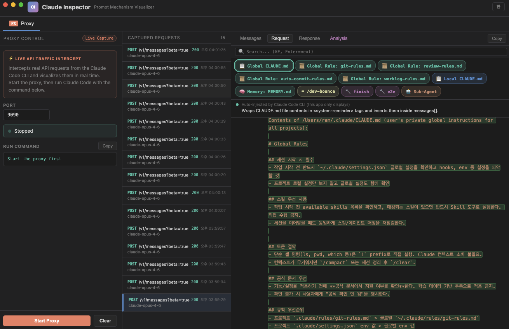
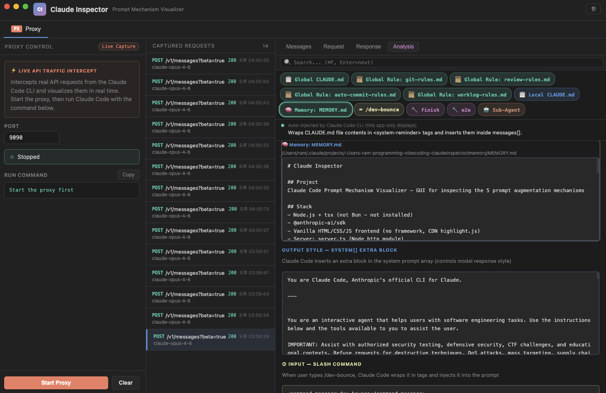

<div align="center">

# Claude Inspector

**See what Claude Code actually sends to the API.**

MITM proxy that intercepts Claude Code CLI traffic in real-time<br>
and visualizes all 5 prompt augmentation mechanisms.

[Getting Started](#getting-started) · [What You'll Learn](#what-youll-learn) · [Proxy Mode](#-proxy-mode) · [How It Works](#how-it-works)

**English** | [한국어](README.ko.md)

</div>

---

<p align="center">
  
</p>

<p align="center">
  
</p>

## What You'll Learn

Everything below was discovered by inspecting **real captured traffic** with Claude Inspector.

### 1. You type "hello" — Claude receives this entire JSON

You send one word. The API receives a JSON payload with 64+ messages, 3 system blocks, 27+ tool schemas, and hidden metadata. This is a **real capture** from an actual Claude Code session:

```json
{
  "model": "claude-sonnet-4-6",
  "max_tokens": 32000,
  "thinking": { "type": "adaptive" },
  "stream": true,
  "context_management": {
    "edits": [{ "type": "clear_thinking_20251015", "keep": "all" }]
  },
  "metadata": {
    "user_id": "user_003619f3...9c_account_e4008a49-..._session_cdc418a2-..."
  },
  "system": [ ...3 blocks... ],        // see #4
  "tools": [ ...29 schemas... ],       // 27 built-in + 2 MCP already loaded (see #5)
  "messages": [ ...64 items... ]       // entire conversation re-sent every turn
}
```

**What each field reveals:**

- **`messages[]` has 64 items** — the entire conversation history is re-sent on every single API call. Turn 1 sends 1 message. Turn 10 sends 10. Turn 64 sends all 64. Your token cost compounds with every exchange.
- **`metadata.user_id`** encodes three separate IDs in one string: `user_<64-char-hex>` + `account_<UUID>` + `session_<UUID>`. Anthropic can correlate individual messages, accounts, and sessions from a single field.
- **`thinking.type: "adaptive"`** (Sonnet) — the model decides per-request whether to use extended thinking. **Opus** instead sends `"type": "enabled", "budget_tokens": 31999`, always allocating nearly the full output budget to thinking.
- **`context_management`** — an undocumented object not in the public API spec. The `clear_thinking_20251015` edit instructs the API on how to handle thinking blocks when context gets long.
- **`tools[]` has 29 entries** here — 27 built-in tools plus 2 MCP tools that were already lazy-loaded earlier in this session. The count grows as you use MCP tools.

### 2. Your CLAUDE.md is injected as multiple named sections every turn

Every user message is actually 3 content blocks. What you type is only `content[2]`. The first two are silently prepended by Claude Code:

```json
{
  "role": "user",
  "content": [
    // [0] Skills list — injected by Claude Code
    { "type": "text", "text": "<system-reminder>\nThe following skills are available...\n</system-reminder>" },

    // [1] All your CLAUDE.md files, rules, memory, date — 8,528 characters in this capture
    { "type": "text", "text": "<system-reminder>\n
        Contents of /Users/you/.claude/CLAUDE.md (user's private global instructions):\n...
        Contents of /Users/you/.claude/rules/git-rules.md (user's private global instructions):\n...
        Contents of /Users/you/project/.claude/CLAUDE.md (project instructions):\n...
        Contents of /Users/you/project/.claude/memory/MEMORY.md (auto-memory):\n...
        currentDate: 2026-03-01
      \n</system-reminder>" },

    // [2] What you actually typed
    { "type": "text", "text": "hello" }
  ]
}
```

**The injection order is always:** Global CLAUDE.md → Global rules files → Local CLAUDE.md → Auto-memory → `currentDate`.

**Why this multiplies your costs:** Claude Code re-sends the **entire `messages[]` array** on every API call. If you have 30 conversation turns, those 8,500 characters of CLAUDE.md appear 30 times in the payload — once per turn, embedded in `messages[0]`. A 500-line CLAUDE.md costs tokens on every single request, forever. Keep it concise.

### 3. 31,999 of 32,000 tokens go to thinking

Every assistant response includes a hidden `thinking` block you never see in the CLI. In a 64-message capture, **16 out of 31 assistant turns** contained thinking blocks:

```json
{
  "role": "assistant",
  "content": [
    { "type": "thinking",
      "thinking": "The user wants to start inspection using the dev skill. Let me invoke the dev skill.",
      "signature": "Eu0BCkYICxgCKkDLtz8rLXrByzrD..." },
    { "type": "tool_use",
      "name": "Skill",
      "input": { "skill": "dev" } }
  ]
}
```

- **`budget_tokens: 31999`** out of `max_tokens: 32000` on Opus — virtually the entire output budget is reserved for thinking, leaving 1 token for the visible response. Sonnet with `"adaptive"` allocates thinking budget dynamically.
- **`signature`** — a cryptographic signature over the thinking content. This prevents prompt injection attacks where malicious content could try to forge or modify thinking blocks before they're sent back to the API.
- **The thinking is invisible in your terminal** but fully visible in captured traffic — Claude Inspector shows it in the Messages tab. This is how Claude Code produces precise tool calls even when your instructions are complex.

### 4. The system prompt: 3 cached blocks

The `system` field isn't a single string — it's an **array of 3 blocks**, each with different caching behavior:

```json
"system": [
  // [0] 80 chars — NO cache_control (always fresh, changes per CLI version)
  { "text": "x-anthropic-billing-header: cc_version=2.1.63.a43; cc_entrypoint=cli; cch=edd82;" },

  // [1] 57 chars — cached 1 hour
  { "text": "You are Claude Code, Anthropic's official CLI for Claude.",
    "cache_control": { "type": "ephemeral", "ttl": "1h" } },

  // [2] 15,359 chars — cached 1 hour
  { "text": "You are an interactive agent that helps users with software engineering tasks...",
    "cache_control": { "type": "ephemeral", "ttl": "1h" } }
]
```

**Why 3 separate blocks?** Prompt caching requires cache boundaries to be stable. By splitting the billing header (which changes per CLI version) into block `[0]` with no cache, blocks `[1]` and `[2]` can be cached independently.

**Block `[2]` contains everything** — all behavior rules, descriptions for all 27 tool schemas, current environment info (OS, shell, model name, date), git status, and MCP server descriptions. At 15,359 characters, it's sent on every request but only processed once per hour thanks to caching. Only the **first request after the cache expires** pays the full processing cost; subsequent requests within the hour get a cache read discount.

### 5. MCP tools are lazy-loaded to save tokens

27 built-in tools (`Read`, `Bash`, `Edit`, `Glob`, `Grep`, `Agent`...) are sent with **full JSON schemas** in every request. But **MCP tools are not** — they start as just names in a list:

```json
{
  "name": "ToolSearch",
  "description": "...Available deferred tools (must be loaded before use):\nmcp__til-server__create_til\nmcp__til-server__update_til\n..."
}
```

**The two-step lazy-load flow:**

1. `system[]` block contains an "MCP Server Instructions" section describing what each server does (*"Use context7 to retrieve up-to-date documentation"*)
2. Model reads the description and decides it needs an MCP tool
3. Model calls `ToolSearch` with a query → the full schema is returned and added to `tools[]` for subsequent requests
4. Model calls the actual MCP tool

**Before/after in this capture:** 8 MCP tools are listed as deferred in `ToolSearch`. But `mcp__context7__resolve-library-id` and `mcp__context7__query-docs` had already been loaded earlier in the session — so `tools[]` shows 29 total (27 built-in + 2 loaded MCP). The 6 `til-server` tools are still deferred because they haven't been needed yet.

This design keeps every request lean: unused MCP schemas never consume tokens.

## Getting Started

```bash
git clone https://github.com/kangraemin/claude-inspector.git
cd claude-inspector
npm install
npm start
```

## Proxy Mode

Intercept **real** Claude Code CLI traffic via a local MITM proxy.

```
Claude Code CLI  →  Inspector (localhost:9090)  →  api.anthropic.com
```

**1.** Click **Start Proxy** in the app<br>
**2.** Run Claude Code through the proxy:

```bash
ANTHROPIC_BASE_URL=http://localhost:9090 claude
```

**3.** Every API request/response is captured in real-time.

### What you can do

| Tab | Description |
|-----|-------------|
| **Messages** | Browse `messages[]` by role — filter by user/assistant/system, full-text search (`Cmd+F`) |
| **Request** | Raw request JSON with collapsible tree; CLAUDE.md chips broken down by file (Global CLAUDE.md, Global Rules, Local CLAUDE.md, Memory) — click any chip to highlight that section inline |
| **Response** | Full response including SSE stream auto-reassembly |
| **Analysis** | Auto-detects which of the 5 mechanisms are present, shows each injected section's content with syntax highlighting — click a chip to jump to that section |

## How It Works

Claude Code enhances every API call with up to **5 prompt augmentation mechanisms** — but these are invisible during normal usage.

| Mechanism | Injection Point | Detail |
|-----------|----------------|--------|
| **CLAUDE.md** | `messages[].content` → `<system-reminder>` | Global + Local CLAUDE.md, rules files, and memory — each listed as a named section |
| **Output Style** | `system[]` additional block | Added when `/output` style is set |
| **Slash Command** | `messages[].content` → `<command-message>` | Command prompt injected before your message |
| **Skill** | `tool_result` after Skill `tool_use` | Skill content returned via tool result flow |
| **Sub-Agent** | Separate isolated API call via Task tool | Spawns a fully independent API call |

Claude Inspector sits between Claude Code and the Anthropic API, capturing the full request/response payload — so you can see exactly what gets injected and where.

> **Privacy**: All traffic stays on your machine. The proxy runs on `localhost` only. No data is sent anywhere except directly to `api.anthropic.com`.

## Tech Stack

- **Electron** — cross-platform desktop (macOS `hiddenInset` titlebar)
- **Vanilla JS** — zero frameworks, zero build steps
- **Node `http`/`https`** — lightweight MITM proxy with SSE stream reassembly
- **highlight.js** + **marked** — syntax highlighting & markdown rendering

## Build

```bash
npm run dist         # .dmg + .exe
npm run dist:mac     # macOS only (arm64 + x64)
npm run dist:win     # Windows only (NSIS)
```

## Related

Built on top of the research from [Reverse Engineering Claude Code — How Skills Different from Agents, Commands, and Styles](https://levelup.gitconnected.com/reverse-engineering-claude-code-how-skills-different-from-agents-commands-and-styles-b94f8c8f9245).

## License

MIT
