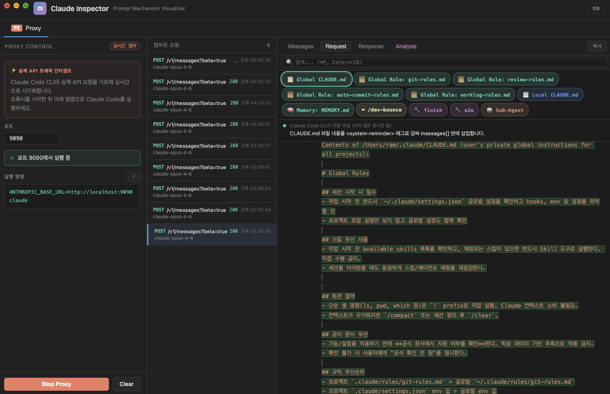
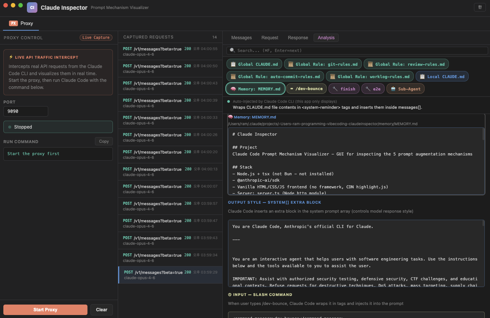

<div align="center">

# Claude Inspector

**See what Claude Code actually sends to the API.**

MITM proxy that intercepts Claude Code CLI traffic in real-time<br>
and visualizes all 5 prompt augmentation mechanisms.

[Install](#install) · [What You'll Learn](#what-youll-learn) · [Proxy Mode](#proxy-mode) · [How It Works](#how-it-works)

**English** | [한국어](README.ko.md)

</div>

---

<p align="center">
  
</p>

<p align="center">
  
</p>

## What You'll Learn

All discovered from **real captured traffic**. See what Claude Code hides from you.

### 1. Your message is never just your message

You type `hello`. Claude Code wraps it with silently prepended blocks:

| Block | What's inside | Size |
|-------|--------------|------|
| `content[0]` | Available skills list | ~2KB |
| `content[1]` | CLAUDE.md + rules + memory + date | **~10KB** |
| `content[2]` | What you actually typed | few bytes |

**Injection order:** Global CLAUDE.md → Global rules → Project CLAUDE.md → Memory

These ~10KB are re-sent with **every request** — not stacked, but always present. A verbose CLAUDE.md silently inflates every API call.

### 2. Claude Code uses multiple models behind the scenes

Not everything runs on Opus/Sonnet. Lighter tasks get routed to cheaper models:

| Task | Model |
|------|-------|
| **Quota check** at startup | Haiku 3.5 |
| **Topic detection** per message | Haiku 3.5 |
| **Bash safety pre-check** | Haiku 3.5 |
| **Context compaction** | Sonnet |
| **Main agent loop** | Your selected model |

Each user message triggers a hidden classification call (`{"isNewTopic": boolean, "title": string}`) before the main model even sees it.

### 3. MCP tools are lazy-loaded to save tokens

- **Built-in tools** (27) — full JSON schemas sent every request
- **MCP tools** — listed as names only, loaded on demand

**The flow:** `ToolSearch` query → full schema returned → added to `tools[]`. Unused MCP tools never consume tokens.

### 4. Skill ≠ Command — three injection paths

Typing `/something` triggers one of three completely different mechanisms:

| | Local Command | User Skill | Assistant Skill |
|---|---|---|---|
| **Example** | `/mcp`, `/clear` | `/commit` | `Skill("finish")` |
| **Who triggers** | User | User | Model |
| **Injection** | `<local-command-stdout>` | Full prompt in user msg | `tool_use` → `tool_result` |
| **Model sees** | Result only | Full prompt | Full prompt |

### 5. Context compaction — lossy compression

When nearing the context limit, the entire conversation is **compressed into 9 structured sections**:

- **Kept:** requests, file paths with line numbers, error history, user messages verbatim, pending tasks
- **Lost:** tool call results, thinking blocks, intermediate back-and-forth

A 153-message conversation (~40KB) → ~10KB summary. The model continues as if it remembers everything, but it's working from a reconstruction.

### 6. Skills and plans persist forever

Once invoked, skill prompts and plan files **stay in every request** until the session ends.

| Persistent context | Size (real capture) |
|--------------------|---------------------|
| 2 invoked skills | ~13KB |
| Active plan file | ~5KB |
| CLAUDE.md + rules | ~10KB |
| Compacted context | ~10KB |
| **Total hidden overhead** | **~38KB per request** |

Five 3KB skills = 15KB added to every request, forever. Unfinished plans keep consuming tokens.

### 7. Every bash command gets a safety check

Before executing any shell command, a **separate LLM call** extracts command prefixes and checks for injection patterns. Commands like `` git diff $(pwd) `` trigger `command_injection_detected` and get blocked.

After execution, another LLM call extracts modified file paths as `<filepaths>` — this powers Claude Code's awareness of what changed.

## Install

### Homebrew (Recommended)

```bash
brew install --cask kangraemin/tap/claude-inspector
open -a "Claude Inspector"
```

### Direct Download

Download the `.dmg` from the [Releases](https://github.com/kangraemin/claude-inspector/releases/latest) page.

| Mac (Apple Silicon) | Mac (Intel) |
|---|---|
| [Claude-Inspector-arm64.dmg](https://github.com/kangraemin/claude-inspector/releases/latest) | [Claude-Inspector-x64.dmg](https://github.com/kangraemin/claude-inspector/releases/latest) |

## For Contributors

```bash
git clone https://github.com/kangraemin/claude-inspector.git
cd claude-inspector
npm install
npm start
```

## Proxy Mode

Intercept **real** Claude Code CLI traffic via a local MITM proxy.

```
Claude Code CLI  →  Inspector (localhost:9090)  →  api.anthropic.com
```

**1.** Click **Start Proxy** in the app<br>
**2.** Run Claude Code through the proxy:

```bash
ANTHROPIC_BASE_URL=http://localhost:9090 claude
```

**3.** Every API request/response is captured in real-time.

### What you can do

| Tab | Description |
|-----|-------------|
| **Messages** | Browse `messages[]` by role — filter by user/assistant/system, full-text search (`Cmd+F`) |
| **Request** | Raw request JSON with collapsible tree; CLAUDE.md chips broken down by file (Global CLAUDE.md, Global Rules, Local CLAUDE.md, Memory) — click any chip to highlight that section inline |
| **Response** | Full response including SSE stream auto-reassembly |
| **Analysis** | Auto-detects which of the 5 mechanisms are present, shows each injected section's content with syntax highlighting — click a chip to jump to that section |

## How It Works

Claude Code enhances every API call with up to **5 prompt augmentation mechanisms** — but these are invisible during normal usage.

| Mechanism | Injection Point | Detail |
|-----------|----------------|--------|
| **CLAUDE.md** | `messages[].content` → `<system-reminder>` | Global + Local CLAUDE.md, rules files, and memory — each listed as a named section |
| **Output Style** | `system[]` additional block | Added when `/output` style is set |
| **Slash Command** | `messages[].content` → `<command-message>` | Command prompt injected before your message |
| **Skill** | `tool_result` after Skill `tool_use` | Skill content returned via tool result flow |
| **Sub-Agent** | Separate isolated API call via Task tool | Spawns a fully independent API call |

Claude Inspector sits between Claude Code and the Anthropic API, capturing the full request/response payload — so you can see exactly what gets injected and where.

> **Privacy**: All traffic stays on your machine. The proxy runs on `localhost` only. No data is sent anywhere except directly to `api.anthropic.com`.

## Tech Stack

- **Electron** — cross-platform desktop (macOS `hiddenInset` titlebar)
- **Vanilla JS** — zero frameworks, zero build steps
- **Node `http`/`https`** — lightweight MITM proxy with SSE stream reassembly
- **highlight.js** + **marked** — syntax highlighting & markdown rendering

## Build

```bash
npm run dist         # .dmg + .exe
npm run dist:mac     # macOS only (arm64 + x64)
npm run dist:win     # Windows only (NSIS)
```

## Related

Built on top of the research from [Reverse Engineering Claude Code — How Skills Different from Agents, Commands, and Styles](https://levelup.gitconnected.com/reverse-engineering-claude-code-how-skills-different-from-agents-commands-and-styles-b94f8c8f9245).

## License

MIT
